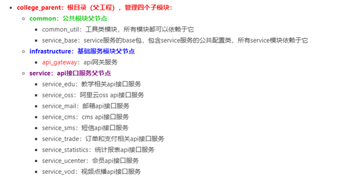
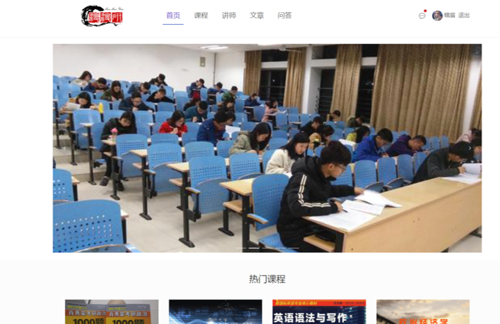
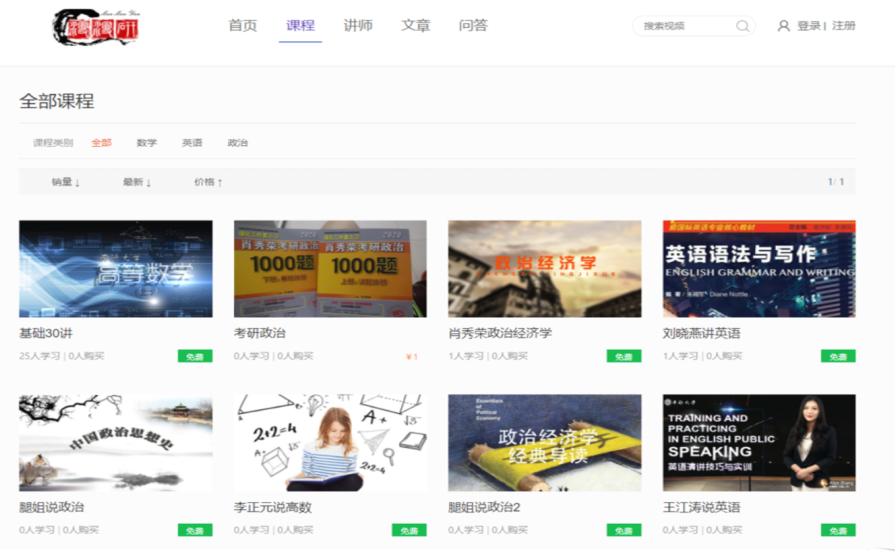
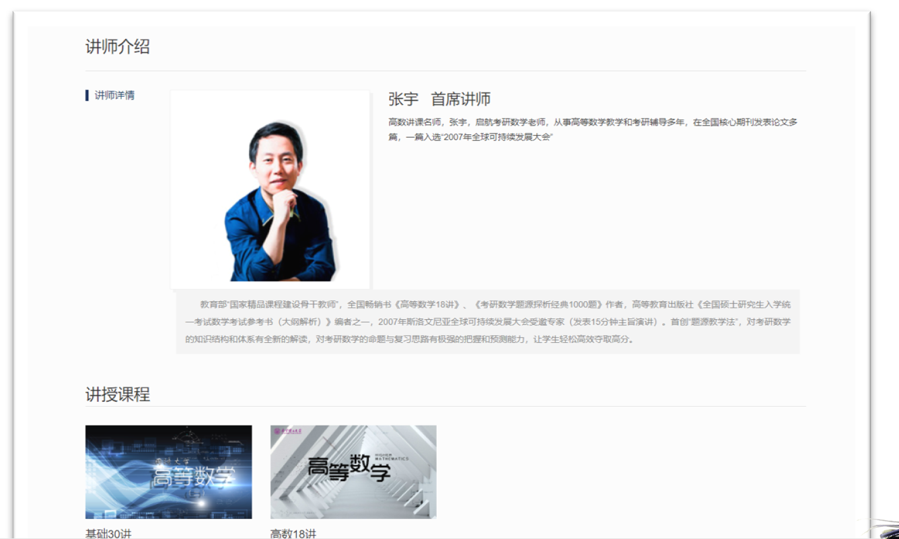
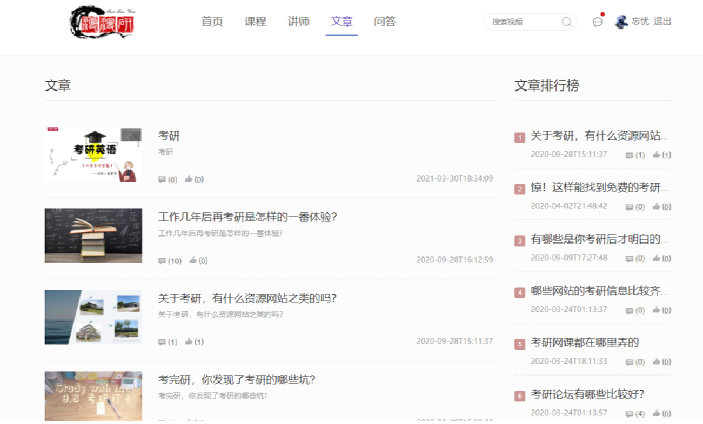
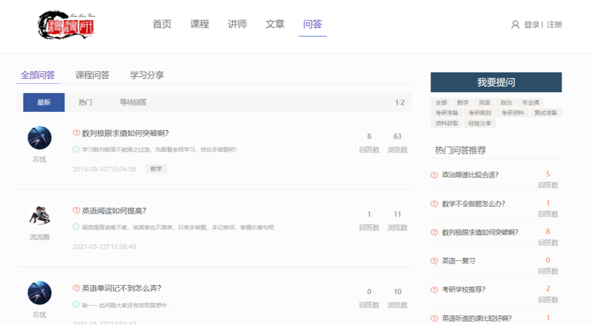

## 漫漫研

### 后端项目结构



**后端相关技术：**

项目前后端相互分离,后端服务封装好RESTful风格的接口供前端调用。AAPI网关使用Spring Cloud Gateway组件,通过Nacos实现服务发现和服务注册的功能,通过Spring Cloud Gateway实现微服务的网关,通过OpenFeign实现服务的调用功能。并使用Redis来实现热点数据的快速访问,使用OAuth2.0以及JWT来实现用户认证。本系统使用Mysql数据库进行数据的存储。整个项目使用声明式的方式来实现服务间的调用,其中具体是通过Spring Cloud OpenFeign进行实现，使用Docker进行部署。使用 Git 进行代码的版本控制，整合了 Swagger 生成接口文档。持久层使用mybatis-plus进行处理。

**前端相关技术：**

系统前端部分，使用主流的前端框架 Vue，使用 Es6 的开发规范，采用模块化的开发模式，搭建页面环境使用了 Nuxt 框架和 vue-admin-template 模板，使用 Element-ui 进行页面布局。前端环境中使用 Npm 进行依赖管理，使用 Babel 进行代码转换，使用 Webpack 进行静态资源的打包，采用 axios 进行 Ajax 请求调用。

#### 运行效果











## 项目模块

前端（前后台）

https://gitee.com/lclcharm/college_admin

https://gitee.com/lclcharm/college_site

后端

https://gitee.com/lclcharm/college_parent

### 本地启动运行

两个前端，分别 clone 后，执行命令

```
npm install
npm run dev
```
